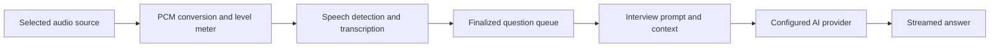

# Reliable Interview Assistant Design

Status: proposed design accompanying the requested feature plan.

## Outcome and scope

Turn the existing Electron scaffold into a polished interview assistant that captures a question from call audio, transcribes it, and streams a useful answer with minimal intervention.
Support conceptual questions such as "How does an LLM work?", system design, coding, and behavioral interviews.
Preserve the existing custom endpoint, API key, and model configuration.

The user confirmed call audio as the primary source, with microphone capture optional.
Windows is the proposed first release target based on the current workspace; other platforms retain their existing functionality and receive explicit capability reporting.
English is the initial evaluation language, without removing existing transcription language settings.
Use the existing selected speech provider; configuring a text model does not imply that it can transcribe audio.
No additional paid provider is required by this design.

## Findings from the working tree

These are source-inspection findings, not claims that the reported failures have been reproduced on a live call.
The workspace contains existing modifications to application files and an untracked Mistral service and pnpm lockfile; implementation must preserve this work.

| Evidence | Implication |
| --- | --- |
| `main.js` initializes `activeSkill` to `dsa` and coding language to C++. | General interviews begin with an unnecessarily narrow context. |
| `prompts/system-design.md` and the off-skill addendum in `prompt-loader.js` already exist. | Broaden and unify existing behavior instead of rebuilding prompt support. |
| `src/ui/main-window.js` captures with `getUserMedia` and processes audio in the renderer. | This path captures the microphone rather than explicitly selecting call audio. |
| `main.js:1269` serializes speech requests, but its completion handler immediately dispatches buffered fragments. | A previous answer finishing can bypass the new utterance's pending pause timer. |
| `src/services/openrouter.service.js:408` streams through a separate HTTP path and resolves accumulated text at EOF. | Empty output, incomplete streams, and cancellation need explicit terminal semantics and regression coverage. |
| `src/services/llm.factory.js` selects a singleton at module load. | Changing providers requires a restart unless this boundary is changed. |
| Speech supports Azure, local Whisper, and Mistral; local worker warmup already exists. | Reuse adapters and warmup while making readiness and recovery visible. |
| `package.json` has a speech connection diagnostic, but no general unit-test or lint script. | Establish deterministic coverage before changing asynchronous flows. |
| Launch and clean scripts use `env -u` and `rm -rf`. | Native Windows development commands need portable implementations. |

## Approach

Recommended: improve the existing Electron and plain JavaScript application, extracting only audio capture and interview orchestration from the large existing controllers.
Retain current provider adapters, session storage, windows, and rendering dependencies where they work.

Alternative: only change prompts and CSS.
That would improve appearance and question coverage, but leave audio-source and request-lifecycle problems unresolved.

Alternative: rewrite the application around a new frontend framework and a realtime multimodal provider.
That would change deployment and provider assumptions without first establishing which existing failures require replacement.
It is outside this release.

## Interaction design

The setup screen has three sections: AI connection, audio setup, and answer preferences.
AI connection displays endpoint, model, masked credential, and a real connection-test result.
Audio setup displays the selected source, input level, speech-provider readiness, and a short transcript test.
Start session becomes available after the necessary checks pass; typed questions remain available if audio setup fails.

The session view uses a compact control strip above a readable answer area.
The strip contains Start/Pause, source and level, interview mode, and Settings.
The content area shows the current recognized question, a short answer first, and supporting detail below it.
Prior questions live in a collapsible session list.
Keep the floating answer view for quick reading, with typography and status behavior shared with chat.

Use a restrained dark palette, one accent color, clear spacing, readable text, and consistent controls.
Use shared color, spacing, typography, and radius variables in `src/styles/common.css`.
Long answers wrap naturally; only code blocks scroll horizontally.
Do not show empty code panels for conceptual or behavioral answers.
Preserve selection and scroll position during streaming; follow new content only while the reader is already at the bottom.
Support keyboard navigation, visible focus, reduced motion, and 100%, 125%, and 150% Windows scaling.

Actions on the current question: Answer now, edit transcript, retry, and stop answer.
Pause stops capture and finalizes any already captured utterance once; End session cancels outstanding work and prevents late updates.
Status distinguishes capture readiness from answer progress, because listening continues while an answer streams.
Example: "Listening to call audio" can coexist with "Answering your previous question".

## Audio and question lifecycle

Validate Windows loopback support against the installed Electron version and a packaged build before committing to a capture mechanism.
Prefer the built-in capture path if it passes the acceptance checks.
If it cannot capture audio reliably, document the measured limitation and select the smallest maintained Windows loopback integration before continuing that task.
Never label microphone capture as call capture or silently switch sources.
System loopback may include other desktop sounds; label it "System audio" unless the implementation actually isolates one application.

Normalize captured frames to the existing speech service's 16 kHz mono signed 16-bit PCM contract.
Use actual input sample rate when resampling; requesting 16 kHz is not sufficient evidence that input is 16 kHz.
Keep optional microphone audio separately identified; use it as context by default, with explicit Answer now for a microphone question.
Do not assume reliable speaker identification from a mixed stream.

Reuse existing speech detection initially, with pre-roll and configurable internal silence timing.
Finalize based on speech activity and transcript completion; do not add a mandatory classification API request before every answer.
Preserve short follow-ups such as "Why?" and "What tradeoffs?" while filtering silence artifacts and repeated final transcript events.
Use event identities for deduplication so a deliberately repeated question can still be answered.
Do not flush an unfinished question simply because a previous answer completed.

Maintain separate capture and answer state machines, coordinated by a session identifier.
Capture states: idle, starting, listening, paused, recovering, error.
Question states: transcribing, queued, generating, completed, cancelled, error.
Every question has a stable ID and every generation attempt has its own request ID.
Only the active session and matching attempt may update a question's answer.
Keep one active generation and up to three finalized pending questions; surface queue saturation and preserve overflow transcripts for manual submission.
End session and Clear session abort active work, clear timers, and discard callbacks from the previous session.

## Interview answer behavior

Default to Auto interview mode, with General, System design, Coding, and Behavioral as optional overrides.
Retain existing specialized modes for compatibility.
Auto uses one general interview instruction that asks the answer model to adapt its response to the question.
Manual modes guide the response but must not refuse a valid question outside the selected specialty.
Share prompt composition across text, speech, and supported screenshot requests.

| Question type | Response shape |
| --- | --- |
| General or conceptual | Direct explanation, essential steps, concrete example, relevant caveat. |
| System design | Stated assumptions, requirements, main components and data flow, bottlenecks, tradeoffs. |
| Coding | Approach, implementation when requested or needed, complexity, edge cases. |
| Behavioral | Suggested structure and wording; ask for missing personal facts or use clearly labeled placeholders. |

For "How does an LLM work?", explain tokenization, embeddings, transformer attention, next-token prediction, training versus inference, and limitations in natural interview language.
Start with a concise explanation and add useful detail without forcing a code block or algorithm-analysis template.
"How is it trained?" must retain the LLM context from the previous question.
Never invent the candidate's employment history, achievements, or metrics.
Use a bounded recent conversation budget and include the current finalized question exactly once.

## Provider and failure behavior

Keep the configured endpoint and model rather than choosing a different provider for the user.
Test credentials through an actual minimal model request; a reachable host alone is not a successful connection test.
Report authentication, invalid model, unsupported operation, rate limit, network timeout, and empty output distinctly.
Use a 15-second first-token timeout, a 15-second stream-idle timeout, and a 90-second total generation deadline as initial tunable defaults.
Allow at most two retries before output starts for retryable network, 429, and 5xx failures, within the same total deadline and respecting bounded Retry-After.
Do not retry invalid credentials or invalid model errors automatically.
After partial output, retain the partial answer and offer retry as a new attempt rather than silently concatenating a restarted answer.
Never present a canned fallback as a successfully generated answer.

Apply provider changes atomically between sessions or via an explicit restart indication; the visible selected provider must match the active provider.
Do not add automatic cross-provider fallback or send audio to a different service without the user's selection.
Use existing local persistence; exclude API keys and raw interview text from normal diagnostic logs.
Record stage timing, IDs, state transitions, and sanitized error codes to diagnose failures.

## Acceptance criteria

Deterministic tests must pass for capture lifecycle, question boundaries, queueing, session cancellation, stream parsing, provider errors, and prompt construction.
Run an interview corpus of at least 30 questions across conceptual, system design, coding, behavioral, and follow-up cases, plus silence and background-noise samples.
The LLM example and its follow-up must produce relevant explanations without unrelated DSA formatting.
No fixture may create duplicate final answers or update a cleared session.
Run a 30-minute Windows session with call audio, pause/resume, optional microphone, a device change, and a simulated provider outage.
No uncaught crash, lost finalized question, or permanently stuck loading state is acceptable.

Measure end-of-question to finalized transcript, finalized transcript to request, and request to first token separately.
Target p95 question dispatch below 200 ms after finalization, first visible answer within 5 seconds of speech ending on the chosen provider and reference machine, and UI state feedback within 100 ms.
The 5-second figure is a measured performance target, not a universal guarantee for arbitrary hardware, models, or networks.
If it is missed, report the stage responsible and tune that stage before claiming seamless performance.

Verify the packaged Windows build from a clean user profile, with no project `.env` or development Python environment available.
Inspect UI screenshots at compact and expanded sizes and all specified display scales.
External failures must leave the question readable and the next recovery action usable.

## Excluded from this release

No frontend framework migration, meeting-platform integrations, cloud sync, analytics dashboard, fine-tuning, resume ingestion, or extra stealth features.
No claim of perfect transcription or guaranteed factual correctness.
The deliverable for the current turn is this design and its implementation plan; application changes follow execution of that plan.
